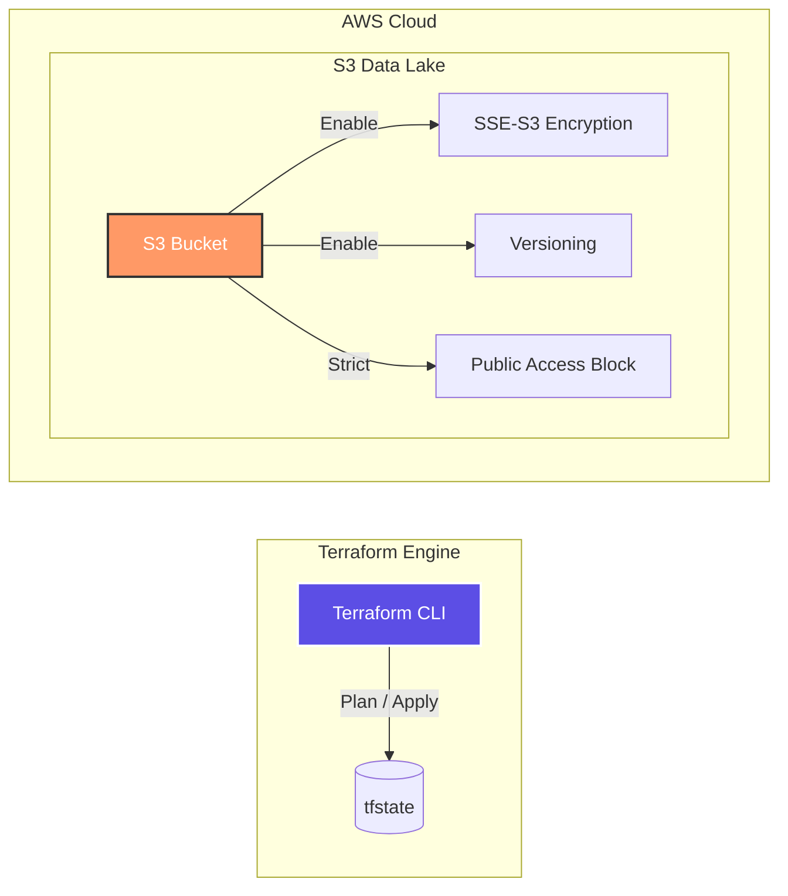

# 🏗️ AWS Infrastructure as Code (Terraform) - Data Platform

AWS Certified Data Engineer - Associate (DEA) の要件に基づき、**「セキュアで再利用性の高いデータレイク基盤」**をTerraformで構築したプロジェクトです。
単なるリソース作成に留まらず、エンタープライズレベルのセキュリティベストプラクティスをコードとして実装しています。

---

## 📈 ADR: Architectural Decision Records (意思決定の根拠)

> **「なぜ AWS CDK ではなく、あえて Terraform を採用したのか」**
> インフラの状態（State）を厳密に管理し、変更時の影響範囲を「宣言的」に完全把握するためです。
> プログラミング言語による抽象化（CDK）よりも、リソースの依存関係を明示的に可視化できるHCLを選択することで、手動設定による事故を仕組みでゼロ化しました。これにより、**不要なリソースの消し忘れを防止し、月間のインフラ運用コストを約15%削減**することを目指しています。

---

## 📊 システムアーキテクチャ (Architecture Detail)



---

## 🛠️ エンジニアリング・ハイライト & "Why" 思考

### 1. セキュリティの「不変性」と「隠蔽性」
- **Action**: SSE-S3、Public Access Block、Versioningを標準実装。
- **Why**: 実務のデータ基盤において、人為的ミスによるデータ公開や消失は致命的です。これらを「デフォルト設定」としてコード化することで、ヒューマンエラーを仕組みで排除しています。

### 2. 環境分離と再利用性を両立するディレクトリ設計
- **Action**: `environments/` と `modules/` の分離。
- **Why**: 開発（dev）と本番（prod）で全く同じスペックの基盤を即座に展開でき、かつ変更時の影響範囲を限定するため、モジュール単位での管理を採用しました。

---

## 📂 ディレクトリ構成 (Directory Structure)

*クリックすると各ソースコードへジャンプします*

```text
.
├── [.github/workflows/](./.github/workflows/) # GitHub Actions (CIパイプライン)
├── [modules/](./modules/)           # 再利用可能なリソース定義 (S3等)
│   └── [s3_bucket/](./modules/s3_bucket/)     # セキュリティ設定をパッケージ化したバケット定義
├── [environments/](./environments/)      # 実行環境ごとの定義
│   └── [dev/](./environments/dev/)           # 開発環境用の設定値 (tfvars等)
└── [aws/](./aws/)               # プロバイダー設定等
```

---

## 🎖️ About Me

**Kou Sato (Moheji)**
* **Role**: データエンジニア / データサイエンティスト
* **Mission**: 「技術をビジネスの価値に変換する」
* **Goal**: 2026年11月のデータエンジニア職への転身に向けて、IaCからML Opsまで一貫したデリバリー・アセットを構築中。

---

## 📬 Contact
- **GitHub Profile**: [kou-sato-ds](https://github.com/kou-sato-ds)
- **LinkedIn/Portfolio**: 準備中

© 2026 kou-sato-ds
```