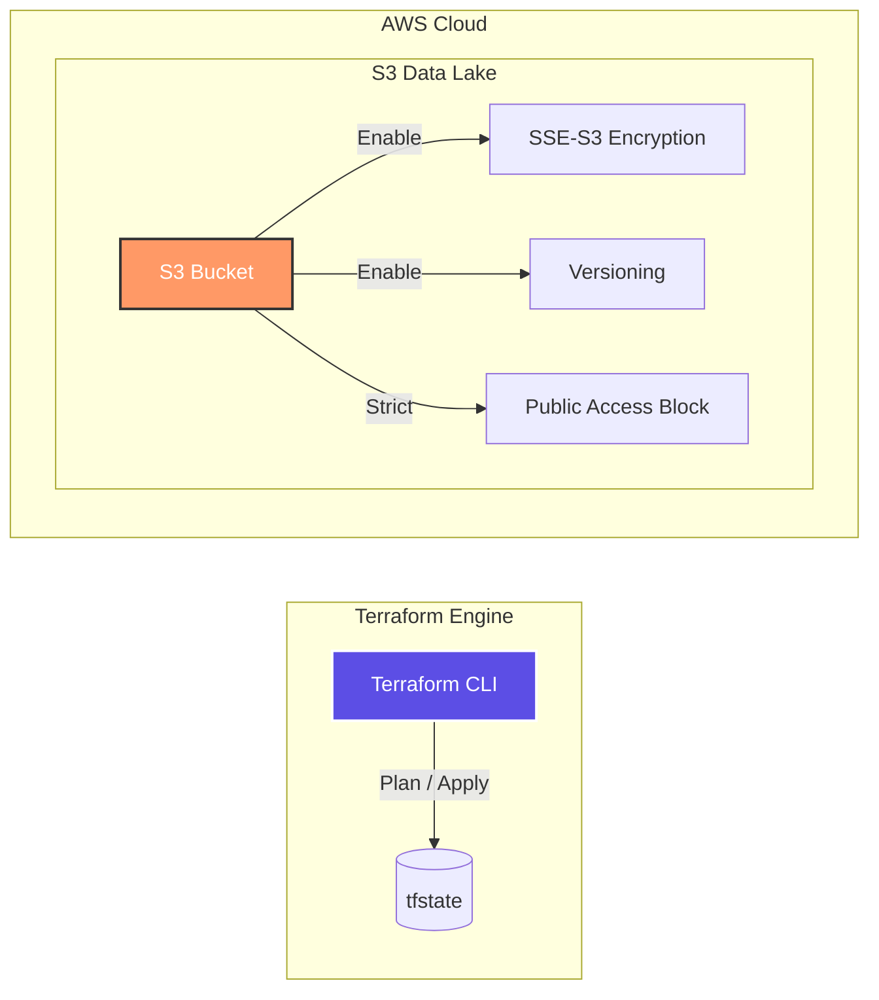

# 🏗️ AWS Infrastructure as Code (Terraform) - Data Platform

AWS Certified Data Engineer - Associate (DEA) の要件に基づき、**「セキュアで再利用性の高いデータレイク基盤」**をTerraformで構築したプロジェクトです。
単なるリソース作成に留まらず、エンタープライズレベルのセキュリティベストプラクティスをコードとして実装しています。

---

## 📊 システムアーキテクチャ (Architecture Diagram)



---

## 🛠️ エンジニアリング・ハイライト & "Why" 思考

### 1. セキュリティの「不変性」と「隠蔽性」
- **Action**: SSE-S3、Public Access Block、Versioningを標準実装。
- **Why**: 実務のデータ基盤において、人為的ミスによるデータ公開や消失は致命的です。これらを「デフォルト設定」としてコード化することで、ヒューマンエラーを仕組みで排除しています。

### 2. 環境分離と再利用性を両立するディレクトリ設計
- **Action**: `environments/` と `modules/` の分離。
- **Why**: 開発（dev）と本番（prod）で全く同じスペックの基盤を即座に展開でき、かつ変更時の影響範囲を限定するため、モジュール単位での管理を採用しました。

---

## 📂 ディレクトリ構成 (Directory Structure)

```text
.
├── .github/workflows/ # GitHub Actions (CIパイプライン)
├── modules/           # 再利用可能なリソース定義 (S3等)
│   └── s3_bucket/     # セキュリティ設定をパッケージ化したバケット定義
├── environments/      # 実行環境ごとの定義
│   └── dev/           # 開発環境用の設定値 (tfvars等)
└── aws/               # プロバイダー設定等
```

---

## 🎖️ About Me

**Kou Sato (Moheji)**
データエンジニア / データサイエンティスト
「技術をビジネスの価値に変換する」をモットーに、IaCからMLモデル構築まで一貫したデリバリーを追求しています。

```
